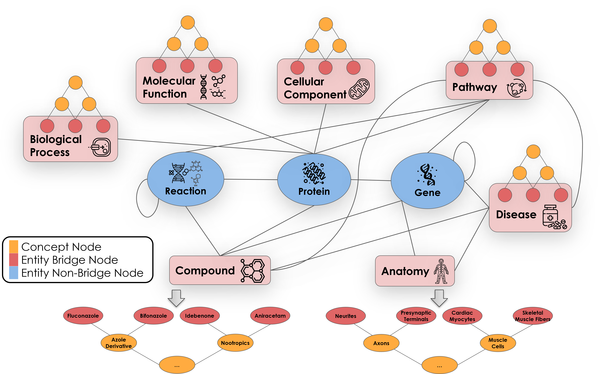

<p align="center">
  
</p>

------------------------------------------------

# Know2BIO

Know2BIO is a comprehensive biomedical knowledge graph benchmark harmonizing heterogeneous database sources.

## Getting Started
### Environment Setup
We recommend using Anaconda3 to manage the environment.
- Install Anaconda3.
- Edit [env.yaml](./env.yaml): set $USER_PATH to user's directory.
- Create `know2bio` environment using `conda env create -f env.yml`.

### Hardware Requirements
- Server: AMD EPYC 7542 Processor (124 cores), 1.73 TB RAM, and 8 NVIDIA A100-SXM4-40GB GPUs.
- Operating system: Ubuntu 20.04 LTS.


## Benchmarking
### Setup
- Python environment: follow the guide in `Environment Setup` Section.
- C++ extensions: compile C++ executable file (`Base.so`)
```bash
cd know2bio/
bash make.sh
```

### Data
There are five required files and one optional file to run the benchmark evaluation.
- `entity2id.txt`: This file contains a list of all entities and their corresponding IDs, with each entity and ID on a separate line. The first line of the file indicates the total number of entities.
- `relation2id.txt`: This file contains a list of all relations and their corresponding IDs, with each relation and ID on a separate line. The first line of the file indicates the total number of relations.
- `train2id.txt`: This file is used for training and contains triples in the following format: (e1, e2, rel), where e1 and e2 are entity IDs and rel is the relation ID. The first line of the file specifies the total number of triples for training. The IDs in this file correspond to the entities and relations listed in entity2id.txt and relation2id.txt, respectively.
- `valid2id.txt`: This file is used for validation and has the same format as test2id.txt. It contains triples in the format (e1, e2, rel), with the first line specifying the total number of triples for validation.
- `test2id.txt`: This file is used for testing and follows the same format as train2id.txt. It contains triples in the format (e1, e2, rel), with the first line specifying the total number of triples for testing.
- `type_constrain.txt` (optional): This file provides type constraints for relations. The first line indicates the total number of relations. Each subsequent line specifies the type constraints for a relation. For example, if a relation with ID 1200 has 4 types of head entities (3123, 1034, 58, and 5733) and 4 types of tail entities (12123, 4388, 11087, and 11088), they would be listed accordingly. This file can be generated using the n-n.py in data/ folder.

### Experiments
- To run the experiments, please excute `main.py` script. Arguments are listed below.
```
usage: main.py [-h] [--model_name MODEL_NAME] [--split SPLIT] [--data_path DATA_PATH] [--ckpt_path CKPT_PATH] [--lr LR] [--batch_size BATCH_SIZE] [--train_epochs TRAIN_EPOCHS] [--opt_method OPT_METHOD]

options:
  -h, --help            show this help message and exit
  --model_name MODEL_NAME
                        Name of the model to be evaluated.
  --split SPLIT         The dataset/split to be used.
  --data_path DATA_PATH
                        Path to the datasets: GO, Know2BIO's ontology/instance/aggregate view, etc.
  --ckpt_path CKPT_PATH
                        Path to the model checkpoints storage.
  --lr LR               Learning rate in training process.
  --batch_size BATCH_SIZE
                        Batch size of for modeling training.
  --train_epochs TRAIN_EPOCHS
                        Number of training epochs.
  --opt_method OPT_METHOD
                        Optimization method for model training.
```

- Example: Train TransE model on Know2BIO's aggregate view
```bash
python main.py --model_name transe --split BMKG --lr 1e-5 --batch_size 1024 --train_epochs 3000 --opt_method adam
```

For the `split` argument: Know2BIO's ontology view, instance view and aggregate view are represented by `ONTO`, `INST` and `BMKG` arguments. GO's biological process, cellular component and molecular function are represented by `BP`, `CC` and `MF` arguments.


## Dataset Construction
### Dataset Schema


### Data Source and Relationships


### Usage and Datasheet
Code and README for the construction of Know2BIO can be found in [dataset](./dataset).